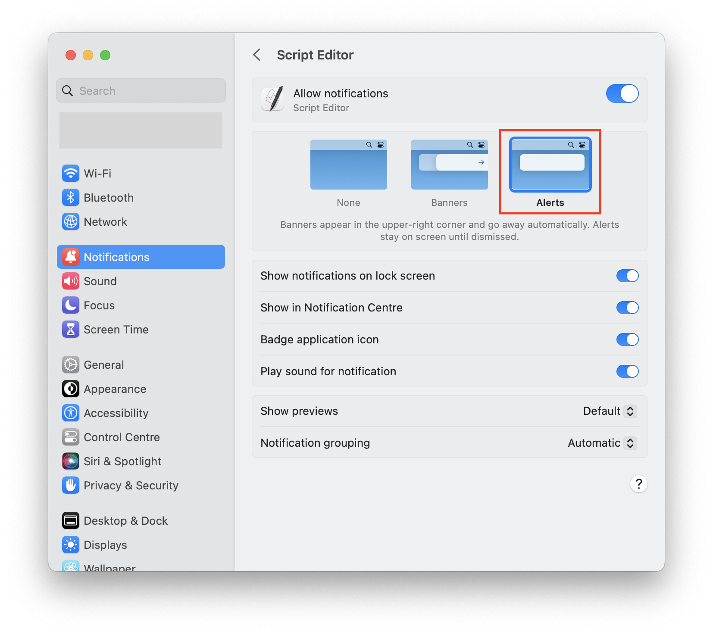

# Ansible Collection - jgosmann.macos_antivirus

The goal
of this Ansible collection
is to provide an easy ClamAV antivirus setup
on macOS.
It will configure clamd
for scanning of files,
automatically keep virus definitions up-to-date,
can watch directories and scan changed/new files therein,
and do a regular scan of recently modified files.

Background tasks are configured
to have reduced CPU and IO priority.
Furthermore,
the regular scan of recently modified files
will only be started
if the Mac is connected to AC power
to avoid draining your battery.

If infected files are found,
they are moved to `~/quarantined`
and a notification is given.

## Prerequisites

The following software must be installed
prior to using the Ansible roles from the collection:

- [Python 3](https://www.python.org/)
- [fswatch](https://github.com/emcrisostomo/fswatch)
- [clamav (with clamd)](https://www.clamav.net/)

This software installation is not done
by the collections's roles
because there are different ways to install it
and I do not want to force a particular way.

### Installing the prerequisistes with MacPorts

If you are a user of [MacPorts](https://www.macports.org/),
the requirements can be installed with these commands
(feel free to use a different Python 3 version):

```bash
sudo port install python311 py311-pip fswatch clamav
sudo port select --set python3 python311
```

### Installing the prerequisites with ...

Pull requests
with instructions for other installation methods
are welcome.

## Usage

### Quick start

If you mostly want to use the defaults,
this is the fastest method to get this up and running.

```bash
# 1. Clone this repository
git clone https://github.com/jgosmann/macos_antivirus.git

# 2. Create a Python venv and install dependencies
cd macos_antivirus
python3 -m venv .venv
source .venv/bin/activate
pip install -r requirements.txt

# 3. Create avwatch configuration
mkdir ~/.config
touch ~/.config/avwatch
# Add directories in which changed files should be scanned for viruses
# to ~/.config/avwatch (one per line).

# 4. Run Ansible quickstart playbook (you'll be asked for the sudo password)
ansible-playbook quickstart.yml
```

Note that by default it is assumed
that prerequisites are installed in `/opt/local`
(as MacPorts does).
This path can be changed
by setting the `prefix` variable.
Furthermore,
it is assumed that a `_clamav` user and group exist
(MacPorts will create these).

Configuration can be adjusted
by setting the respective variables
on the command line
with `--extra-vars`, e.g.:

```bash
ansible-playbook quickstart.yml --extra-vars prefix=/usr/local
```

### macOS behavior and settings

#### Notifications

I recommend to configure the "Script Editor" notifications as "alerts"
in the system settings,
such that notifications about infected files are not missed.



#### Allow in the background

After setup of the Ansible roles,
you will get notification
that the following background items have been added:

* avwatch.sh
* clamd
* freshclam
* python3

#### Permissions to access files

When the first files are scanned,
you may be asked to grant access to different folders
(Desktop, Documents, Downloads, etc.)
to `python3`.


### Usage in custom Ansible playbooks

Integrating the collection's roles
into your own Ansible playbook
gives you full flexibility.
The steps are as follows:

1. Install collection:
   ```bash
   ansible-galaxy collection install jgosmann.macos_antivirus
   ```
2. Reference desired roles in your playbook
   and set variables according to desired configuration.
3. If using the `avwatch` roles (or the `antivirus` role including it),
   provide an `~/.config/avwatch` file
   with a list of directories (one per line)
   in which changed files should be scanned for viruses.

## Documenation of Ansible roles

Some variables are common to all roles:

| Variable              | Default                    | Description                             |
|-----------------------|----------------------------|-----------------------------------------|
| prefix                | `/opt/local`               | Installation prefix of prerequisites.   |
| python3_path          | `{{ prefix }}/bin/python3` | Path to `python3`.                      |
| install_bin_directory | `/usr/local/bin`           | Path where roles install their scripts. |


### antivirus

Meta-role that includes `avfullscan`, `avwatch`, and `freshclam`.


### avfullscan

Installs a regular scan of recently modified files.
The scan will only start if your Mac is connected to AC power.

The "full" scan can also be invoked manually ``
with the `avfullscan.py <directory> [directory ...]` command.
Use `avfullscan.py --help` to see available options

#### Variables

| Variable              | Default                    | Description                             |
|-----------------------|----------------------------|-----------------------------------------|
| avfullscan_check_interval_secs | `3600` (1 hour)   | Interval between checks if another scan should be started. |
| avfullscan_dirs       | `["~"]`                    | Directories to include in the "full" scan. |
| avfullscan_scan_days  | `7`                        | Files modified within the given time range are scanned. |
| avfullscan_interval_secs | `86400` (1 day)         | Interval between scans.                 |
| avfullscan_path       | `{{ install_bin_directory }}/avfullscan.py` | Installation path for the `avfullscan.py` script. |
| avfullscan_require_ac | `true`                     | Only start the "full" scan if connected to AC power. |
| avfullscan_timestamp_file_path | `~/.avfullscan.timestamp` | File to store the timestamp of the last scan. |


#### Included roles

* avscan


### avscan

Installs the `avscan.py` script.
It is a wrapper around `clamdscan`
to submit files to `clamd` for scanning.
Infected files will be moved to `~/quarantine`
and a GUI notification will be shown.
See `avscan.py --help` for available options.

#### Variables


| Variable              | Default                    | Description                             |
|-----------------------|----------------------------|-----------------------------------------|
| avscan_path           | `{{ install_bin_directory }}/avscan.py` | Installation path for the `avscan.py` script. |

#### Included roles

* clamd


### avwatch

Installs a launch agent
to watch directories for changed files
and scan them with `avscan.py` (clamd).

The directories to watch need to be configured
with the file `~/.config/avwatch`
(one directory per line).

#### Variables

| Variable              | Default                    | Description                             |
|-----------------------|----------------------------|-----------------------------------------|
| fswatch_path          | `{{ prefix }}/bin/fswatch` | Path to `fswatch`.                      |
| avscan_path           | `{{ install_bin_directory }}/avscan.py` | Path to the `avscan.py` script. |
| avwatch_path          | `{{ install_bin_directory }}/avwatch.sh` | Installation path for the `avwatch.sh` script. |

#### Included roles

* avscan


### clamd

Installs a launch daemon
running `clamd` in the background.

#### Variables

| Variable              | Default                    | Description                             |
|-----------------------|----------------------------|-----------------------------------------|
| clamd_additional_config | `''`                     | Content to insert at the end of the clamd configuration file. |
| clamd_config_path     | `{{ prefix }}/etc/clamd.conf | Path to the `clamd` configuration.    |
| clamd_group           | `_clamav`                  | Group to run the daemon under.           |
| clamd_local_socket    | `/tmp/clamd.socket`        | Path to the `clamd`  socket file.       |
| clamd_log_file        | `/tmp/clamd.log`           | Path to the `clamd`  log file.          |
| clamd_user            | `_clamav`                  | User to run the daemon under.           |
| clamd_path            | `{{ prefix }}/sbin/clamd   | Path to `clamd`.                        |


### freshclam

Installs a launch daemon
running `freshclam`
(updating the virus signature database)
on boot and each day thereafter.

#### Variables

| Variable              | Default                    | Description                             |
|-----------------------|----------------------------|-----------------------------------------|
| clamd_group           | `_clamav`                  | Group to run the daemon under.          |
| clamd_user            | `_clamav`                  | User to run the daemon under.           |
| freshclam_additional_config | `''`                     | Content to insert at the end of the freshclam configuration file. |
| freshclam_config_path | `{{ prefix }}/etc/freshclam.conf` | Path to the `freshclam` configuration. |
| freshclam_path        | `{{ prefix }}/bin/freshclam` | Path to `freshclam`.                  |
| freshclam_update_log_file | `/var/log/freshclam.log` | Path to the `freshclam` log file.     |
